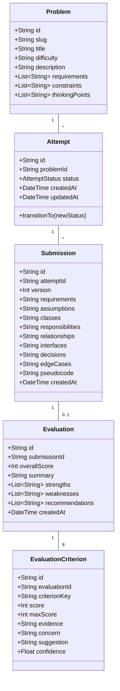

# Domain Design & Architectural Specification

## 1. Problem Statement & System Goal
The **LLD Practice Platform** is a specialized tool designed to evaluate low-level object-oriented designs submitted by software engineering candidates. The platform provides a structured design submission workflow, automated deterministic and AI-powered evaluation against a fixed 8-dimension rubric, and attempt versioning to enable iterative learning.

---

## 2. Product Decisions & Scope Boundaries

### 2.1 Core Product Decisions
1. **Structured Text Submission vs Visual UML**: Structured text fields (Requirements, Class Responsibilities, Interfaces & Relationships, Design Trade-offs, Edge Cases, Pseudocode) provide clear evidence of design quality without the overhead of building or maintaining a canvas/UML visual editor.
2. **Deterministic Gate before LLM Evaluation**: Malformed or incomplete submissions fail fast during deterministic validation, saving LLM tokens and avoiding unnecessary API calls.
3. **Immutability of Submissions**: An `Attempt` tracks the session, while `Submission` records immutable snapshots (v1, v2, v3). This ensures submission data is saved to SQLite *before* evaluation starts, preventing data loss on AI failure.
4. **Strategy Pattern for Evaluation**: Practice workflows depend on the `Evaluator` interface, isolating domain logic from specific LLM providers (`@google/genai`, OpenAI, or local rule-based fallback).

### 2.2 What We Explicitly Did NOT Build (Non-Goals)
- **No LMS / Video Courseware**: Focus purely on active practice and automated evaluation.
- **No Social / Gamification / Leaderboards**: Eliminates scope creep; keeps focus on engineering depth.
- **No Complex Authentication**: A lightweight default user session allows instant practice without friction.
- **No Microservices / Distributed Queues (Kafka/RabbitMQ/Redis)**: Monolithic NestJS backend avoids distributed state complexity while satisfying 2-day MVP scope.
- **No Canvas-based Visual UML Editor**: Avoided spending 80% of development time on UI canvas mechanics.

---

## 3. End-to-End User Flow

```
+-------------+      +-----------------+      +---------------+
| Problem List | ---> | Problem Details | ---> | Start Attempt |
+-------------+      +-----------------+      +---------------+
                                                      |
                                                      v
+----------------+      +------------------+      +-------------------+
| Feedback Screen| <--- | Evaluation Exec  | <--- | Design Workspace  |
+----------------+      +------------------+      +-------------------+
        |                                                 ^
        |               +------------------+              |
        +-------------> |  Attempt History | -------------+ (Retry/Improve)
                        +------------------+
```

---

## 4. Domain Model & Class Responsibilities



### 4.1 Domain Entity Responsibilities

1. **`Problem`**:
   - **Responsibility**: Owns problem definitions, difficulty ratings, requirements, constraints, and guided evaluation pointers.
   - **Dependencies**: None.
   - **Change Reason**: Changes when problem specs or requirements are updated.

2. **`Attempt`**:
   - **Responsibility**: Owns practice session lifecycle state machine. Enforces transition rules (`IN_PROGRESS` → `SUBMITTED` → `EVALUATING` → `COMPLETED` / `FAILED`).
   - **Dependencies**: `Problem`.
   - **Change Reason**: Changes when learner status transitions occur.

3. **`Submission`**:
   - **Responsibility**: Immutable snapshot of structured design data for a specific attempt version.
   - **Dependencies**: `Attempt`.
   - **Change Reason**: Immutable; never changes after creation. Retries generate new versioned instances.

4. **`Evaluation` & `EvaluationCriterion`**:
   - **Responsibility**: Represents structured scoring outcomes against the 8 Rubric dimensions.
   - **Dependencies**: `Submission`.
   - **Change Reason**: Represents fixed historical evaluation results.

---

## 5. Attempt Lifecycle & State Machine

```
               +-------------+
               | IN_PROGRESS |
               +-------------+
                      |
                      | submit()
                      v
                +-----------+
                | SUBMITTED |
                +-----------+
                      |
                      | startEvaluation()
                      v
               +------------+
               | EVALUATING |
               +------------+
                 /        \
    complete()  /          \ fail()
               v            v
        +-----------+    +--------+
        | COMPLETED |    | FAILED |
        +-----------+    +--------+
```

### State Transition Validation Matrix
| From State | To Allowed State | Action |
| :--- | :--- | :--- |
| `IN_PROGRESS` | `SUBMITTED` | Learner clicks "Submit Design". Submission snapshot created. |
| `SUBMITTED` | `EVALUATING` | `EvaluationService` begins processing. |
| `EVALUATING` | `COMPLETED` | Evaluator returns structured evaluation payload successfully. |
| `EVALUATING` | `FAILED` | Evaluator throws unhandled exception or parsing error. |
| `COMPLETED` | Any | ❌ Illegal Transition. A completed attempt cannot be re-submitted; a new attempt/revision must be created. |
| `FAILED` | `EVALUATING` | Learner/system triggers evaluation retry on persisted submission. |

---

## 6. Evaluation System Architecture (Strategy Pattern)

```
                       EvaluationService
                               |
            +------------------+------------------+
            | (Stage 1: Deterministic Check)      | (Stage 2: Strategy)
            v                                     v
   DeterministicValidator                     Evaluator (Interface)
   - Field presence checks                    /                 \
   - Structural rule validation       AIEvaluator          RuleBasedEvaluator
   - Fail fast on invalid content     - Gemni / LLM        - Heuristic scoring
                                      - Structured JSON    - Offline fallback
```

### 6.1 The 8 Rubric Dimensions
1. **`Requirement Understanding`**: Accuracy in capturing functional and non-functional scope.
2. **`Class Responsibilities`**: Adherence to Single Responsibility Principle (SRP).
3. **`Coupling & Cohesion`**: High cohesion within modules; low coupling across boundaries.
4. **`Encapsulation & Interfaces`**: Information hiding and dependence on abstractions.
5. **`Abstraction / Design Patterns`**: Justified use of design patterns (Strategy, Factory, Observer, etc.).
6. **`Extensibility`**: Resilience to future requirement changes.
7. **`Edge Cases & Testability`**: Identification of race conditions, boundary states, and unit testability.
8. **`Quality of Explanation`**: Clarity, reasoning, and justification of design trade-offs.

---

## 7. Trade-off Analysis & Architectural Decision Records (ADRs)

### ADR-01: NestJS Monolith vs Microservices
- **Decision**: Monolithic NestJS application.
- **Reason**: 2-day assignment window; avoids distributed tracing, inter-service networking, and redundant deployment setup.
- **Alternative**: Separate Problem Service, Evaluation Service, and Submission Service.
- **Trade-off**: Lower isolated scale capabilities; gained massive development velocity and single-repo simplicity.
- **Interview Explanation**: "For a 2-day MVP, a modular monolith inside NestJS provides clean domain boundaries via Nest modules without incurring microservices network latency and operational complexity."

### ADR-02: SQLite + Prisma ORM vs PostgreSQL
- **Decision**: SQLite database with Prisma ORM.
- **Reason**: Zero setup friction for recruiters/evaluators (single file database); seamless schema migrations via Prisma.
- **Alternative**: PostgreSQL via Docker container.
- **Trade-off**: Concurrent write limits under extreme concurrency; gained 1-command setup (`npx prisma db seed`).
- **Interview Explanation**: "SQLite is a deliberate trade-off for zero-dependency local testing. Prisma ORM abstracts the database layer, enabling a seamless transition to PostgreSQL in production by altering one line in `schema.prisma`."

### ADR-03: Strategy Pattern for AI Evaluation
- **Decision**: `Evaluator` interface implemented by `AIEvaluator` and `RuleBasedEvaluator`.
- **Reason**: Decouples practice logic from third-party LLM APIs; enables offline execution without API keys.
- **Alternative**: Direct OpenAI/Gemini SDK calls inside `SubmissionService`.
- **Trade-off**: Requires structured JSON parsing & validation; gained complete isolation and testability.
- **Interview Explanation**: "By programming to an `Evaluator` interface, the submission domain remains agnostic of the evaluation engine. We can switch from Gemini to Claude, OpenAI, or local deterministic rules without changing domain business logic."
